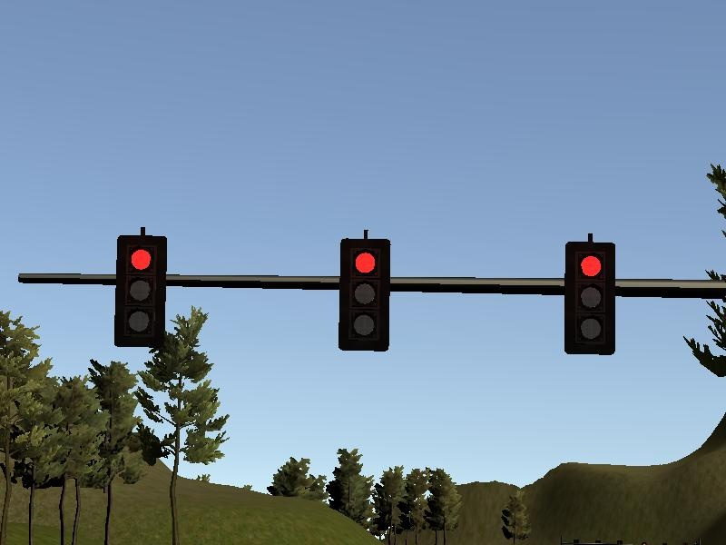

# Udacity Self Driving Car Nanodegree Final Capstone Project
---

<a href="https://www.youtube.com/watch?v=Gf_TYV_vnek">
</a>
<br> Self Driving Car Running on the Simulator Track <br>

This is the project repo for the final project of the Udacity Self-Driving Car Nanodegree: Programming a Real Self-Driving Car. For more information about the project, see the project introduction [here](https://classroom.udacity.com/nanodegrees/nd013/parts/6047fe34-d93c-4f50-8336-b70ef10cb4b2/modules/e1a23b06-329a-4684-a717-ad476f0d8dff/lessons/462c933d-9f24-42d3-8bdc-a08a5fc866e4/concepts/5ab4b122-83e6-436d-850f-9f4d26627fd9).

Please use **one** of the two installation options, either native **or** docker installation.

### Native Installation

* Be sure that your workstation is running Ubuntu 16.04 Xenial Xerus or Ubuntu 14.04 Trusty Tahir. [Ubuntu downloads can be found here](https://www.ubuntu.com/download/desktop).
* If using a Virtual Machine to install Ubuntu, use the following configuration as minimum:
  * 2 CPU
  * 2 GB system memory
  * 25 GB of free hard drive space

  The Udacity provided virtual machine has ROS and Dataspeed DBW already installed, so you can skip the next two steps if you are using this.

* Follow these instructions to install ROS
  * [ROS Kinetic](http://wiki.ros.org/kinetic/Installation/Ubuntu) if you have Ubuntu 16.04.
  * [ROS Indigo](http://wiki.ros.org/indigo/Installation/Ubuntu) if you have Ubuntu 14.04.
* [Dataspeed DBW](https://bitbucket.org/DataspeedInc/dbw_mkz_ros)
  * Use this option to install the SDK on a workstation that already has ROS installed: [One Line SDK Install (binary)](https://bitbucket.org/DataspeedInc/dbw_mkz_ros/src/81e63fcc335d7b64139d7482017d6a97b405e250/ROS_SETUP.md?fileviewer=file-view-default)
* Download the [Udacity Simulator](https://github.com/udacity/CarND-Capstone/releases).

### Docker Installation
[Install Docker](https://docs.docker.com/engine/installation/)

Build the docker container
```bash
docker build . -t capstone
```

Run the docker file
```bash
docker run -p 4567:4567 -v $PWD:/capstone -v /tmp/log:/root/.ros/ --rm -it capstone
```

### Port Forwarding
To set up port forwarding, please refer to the [instructions from term 2](https://classroom.udacity.com/nanodegrees/nd013/parts/40f38239-66b6-46ec-ae68-03afd8a601c8/modules/0949fca6-b379-42af-a919-ee50aa304e6a/lessons/f758c44c-5e40-4e01-93b5-1a82aa4e044f/concepts/16cf4a78-4fc7-49e1-8621-3450ca938b77)

### Usage

1. Clone the project repository
```bash
git clone https://github.com/udacity/CarND-Capstone.git
```

2. Install python dependencies
```bash
cd CarND-Capstone
pip install -r requirements.txt
```
3. Make and run styx
```bash
cd ros
catkin_make
source devel/setup.sh
roslaunch launch/styx.launch
```
4. Run the simulator

# Details of Implementaion
Now let's see the details of implementation that I have done for completion of this project.

## Autonomous Car System Architecture
The autonomous car which will run on the track in simulator, has the system architecure as mentioend in the diagram below.

<br>
Now let's see all the modules present in this architecure in details.
## Planning
The planning module is responsible for planning the path for car movements on the road. This modules creates a path to traverse on the track considering the environments, ex. traffic.
This module in composed of two ROS nodes:
1. Waypoint Loader
2. Waypoint Updater

#### Waypoint Loader
This node is responsible for loading the `waypoints` provided by the simulator and publishing them on `/base_waypoints` topic. Thus, this can be considered as a **Staring Point** of the project. Also, the `frameid` for the `waypoints` published is `/world`.
These `waypoints` are of type `Lane` defined under `styx_msgs/msg/Lane.msg`
<br>
The waypoint contains below data items. All these items are updated with data received from simulator.
1. `position x`: `x` location of the vehicle
2. `position y`: `y` location of the vehicle
3. `position z`: `z` location of the vehicle
4. `orientation`: Car's yaw angle
5. `twist.linear.x`: Car's velocity
<br>

#### Waypoint Updater Node
This node contains `waypoint_updater.py`. This node updates the velocity property of every waypoint based on traffic light and obstacles detected.<br>
This node subscribes to 
1. `/base_waypoints`: Published by `Waypoint Loader`
2. `/current_pose`: Published by `Car/Simulator`
3. `/obstacle_waypoint`: Published by `Obstacle Detection` from `Perception` module
4. `/traffic_waypoint`: Published by `Traffic Light Detection Node` from `Perception` module
<br>

In `waypoint_updater.py` I've implemented a method named `closest_waypoint` which returns the index of waypoint which is closest to the car. This will traverse through all the available waypoints and find the closest one.
<br>

```python
    def closest_waypoint(self, pose, waypoints):
        # simply take the code from the path planning module and re-implement it here
        closest_len = 100000 # Taken some very large number against which closest waypoint will be calculated.
        closest_waypoint = 0
        dl = lambda a, b: math.sqrt((a.x-b.x)**2 + (a.y-b.y)**2)
        for index, waypoint in enumerate(self.waypoints):
            dist = dl(pose.position, waypoint.pose.pose.position)
            if (dist < closest_len):
                closest_len = dist
                closest_waypoint = index

        return closest_waypoint
```
<br>
Also in another method named `decelerate`, we're calculating the `velocity` for every waypoint based on the input from `traffic light` and car's distance from `STOP_DIST`. If the traffic light happens to be `red`, then the car will decelerate and stop just before stop line.
<br>

```python
if index > redlight_index:
                vel = 0
            else:
                dist = self.distance(wp.pose.pose.position, last.pose.pose.position)
                dist = max(0, dist - STOP_DIST)
                vel  = math.sqrt(2 * MAX_DECEL * dist)
                if vel < 1.:
                    vel = 0.
            wp.twist.twist.linear.x = min(vel, wp.twist.twist.linear.x)
```
<br>

## Perception
The perception module is for detection of traffic lights and obstacles which come in the way of our autonomous car. That's how this module is composed of two ROS nodes
1. Obstacle Detection
2. Traffic Light Detection

#### Obstacle Detection
The intension of this module for handling all the vehicles that come in the path of our autonomous vehicle.
<br>
The Autonomous vehicle is supposed to travel at a max speed of `30 mph` as predefined in `waypoint_updater.py`. Thus, if any slow moving vehicle comes in the path of our AV car, the car has to find a new path in order to overtake the slow moving vehicle.
<br>
Thus, using a path planning module a path is generated and traveresed by the AV car to overtake the slow moving vehicle.
<br>
The `Obstacle Detection` node subscribes to
1. `/image_color`: Published by Car/Simulator
2. `/current_pose`: Published by Car/Simulator
3. `/base_waypoints`: Published by `waypoint_loader`
<br>
After finding the obstacles in the path and their waypoints, node publishes the obstacle waypoints over topic `/obstacle_waypoint` which is consumed by `waypoint_updater`
<br>

#### Traffic Light Detection
This node is responsible for detecting the traffic lights and classifying them to be `Red` or `Green` or `Yellow`. This node subscribes to `/image_color`, `/current_pose`, `/base_waypoints`.
<br>
This internally consists of two nodes,
1. Traffic Light Detection
This node receives the image taken from camera mounted on the car and checks for traffic lights in it. Once the image received, `process_traffic_lights` method from `tl_detector.py` is called which does alll the operations.
<br>
The image captured from car mounted camera looks like this.

<br>

```python
def process_traffic_lights(self):
        """Finds closest visible traffic light, if one exists, and determines its
            location and color

        Returns:
            int: index of waypoint closest to the upcoming stop line for a traffic light (-1 if none exists)
            int: ID of traffic light color (specified in styx_msgs/TrafficLight)

        """
        light = None
        stop_line_positions = self.config['stop_line_positions']

        if(self.pose and self.waypoints):
            light_position = self.get_closest_index(self.pose.pose, self.lights)        # Identifies the closest light to the position of car
            light_wp = self.get_closest_index(self.lights[light_position].pose.pose, self.waypoints.waypoints)
            lines = list()
            for light_pos in stop_line_positions:
                light =  self.generate_light(light_pos[0], light_pos[1], 0.)
                lines.append(light)
            line_wp = self.get_closest_index(lines[light_position].pose.pose, self.waypoints.waypoints)
            state = self.get_light_state(self.lights[light_position])           # This is called from Traffic light classification to check traffic light color
            return line_wp, state

        if light:
            state = self.get_light_state(light)
            return light_wp, state
        return -1, TrafficLight.UNKNOWN
```
<br>

2. Traffic Light Classification
This node classfies the detected traffic lights for their colors. This is implemented in `light_classification/tl_classifier.py`.
<br>
All the implementation for traffic light color detection is done by `opencv` only. We convert the image received into HSV color channel. The HSV color channel is used since it keeps a good consistency in the image even if it has some shadow effects on the target object. This has been explained in `Advanced Lane Detection` where a shadow from tree on the road changes the color value of road lanes, but if we use HSV color space, the consistency of colors for those lanes is quite stable.
<br>
The traffic light color detection is implemented as below
<br>

```python
def get_classification(self, image):
    """
    Determines traffic signal color using opencv filters
    Arguments:
        image (cv::Mat): image containing the traffic light
    Returns:
        int: ID of traffic light color (specified in styx_msgs/TrafficLight)
    """
    try:
        trafficLight = TrafficLight.UNKNOWN
        hsv = cv2.cvtColor(image, cv2.COLOR_BGR2HSV) # Convert to HSV

        # Here, we're using opencv for classifying the traffic signal lights.
        # From the experiments done on received images, lower and upper threshold
        # values for red color were found as below

        lower_red = np.array([0,50,50])         # Define lower threshold for red color
        upper_red = np.array([10,255,255])      # Define upper threshold for red color

        # Anything between HSV value [0, 50, 50] to [10, 255, 255] is considered as red

        red1 = cv2.inRange(hsv, lower_red , upper_red)

        lower_red = np.array([170,50,50])
        upper_red = np.array([180,255,255])
        red2 = cv2.inRange(hsv, lower_red , upper_red)    # Checking for available red color signal

        converted_img = cv2.addWeighted(red1, 1.0, red2, 1.0, 0.0)

        blur_img = cv2.GaussianBlur(converted_img,(15,15),0)

        # Finding circles of red colored signals (actual dump is filtered grayscale)
        circles = cv2.HoughCircles(blur_img,cv2.HOUGH_GRADIENT,0.5,41, param1=70,param2=30,minRadius=5,maxRadius=150)

        # If found shape is a circle, it's a red signal. else it's unknown
        if circles is not None:
            trafficLight = TrafficLight.RED
    except Exception as e:
        # If there's an exception, should return as red considering safety
        trafficLight = TrafficLight.RED
        rospy.logerror(e)
    finally:
        return trafficLight
```
<br>

At the end of above mentioned method `get_classification`, we're checking for `HoughCircles` which returns the circles. If the circles are found in the image, it's red traffic light. We're skipping detection of green and yellow light since there's no traffic on the simulator road, and red is the only traffic light where we'll be braking the car, else we can keep driving.
<br>
The Hough Circles look like below image.

<br>

## Control
The control module actually drives the Autonomous Vehicle on the road. It consists of two ROS nodes
1. DBW Node
2. Waypoint Follower
Let's see these nodes in detail.

#### DBW Node
This is `Drive By Wire` node which is used for actuations requried in the car, ex. push a throttle for more gas, apply brakes, steer the vehicle by some x angle etc.
<br>
The DBW node subscribes to
1. `/current_velocity`: Published by Car/Simulator
2. `/vehicle/dbw_enabled`: Published by Car/Simulator
3. `/twist_cmd`: Published by Waypoint follower node
<br>
There are some pre-defined constant car values present in `dbw_node.py` which are used for multiple calulations like the calculation for how much power to put on brakes considering car's weight.

```python
cp.vehicle_mass = rospy.get_param('~vehicle_mass', 1736.35)
cp.fuel_capacity = rospy.get_param('~fuel_capacity', 13.5)
cp.brake_deadband = rospy.get_param('~brake_deadband', .1)
cp.decel_limit = rospy.get_param('~decel_limit', -5)
cp.accel_limit = rospy.get_param('~accel_limit', 1.)
cp.wheel_radius = rospy.get_param('~wheel_radius', 0.2413)
cp.wheel_base = rospy.get_param('~wheel_base', 2.8498)
cp.steer_ratio = rospy.get_param('~steer_ratio', 14.8)
cp.max_lat_accel = rospy.get_param('~max_lat_accel', 3.)
cp.max_steer_angle = rospy.get_param('~max_steer_angle', 8.)
cp.min_speed = 0.1
```
This `dbw_node.py` calls a method `control` from `twist_controller.py` which calculates how much throttle, brake and steering angle is required for the next step. This `control` method takes in three parameters viz, `twist_cmd`, `current_velocity` and `del_time`.
<br>
The `twist_cmd` is the last twist command executed. `current_velocity` is required for calculation of velocity of next waypoint. And `del_time` is for the syncronization in `pid` control step.
The implementation looks like below.

```python
def control(self, twist_cmd, current_velocity, del_time):
    lin_vel = abs(twist_cmd.twist.linear.x)
    ang_vel = twist_cmd.twist.angular.z
    vel_err = lin_vel - current_velocity.twist.linear.x

    next_steer = self.yaw_controller.get_steering(lin_vel, ang_vel, current_velocity.twist.linear.x)
    next_steer = self.s_lpf.filt(next_steer)

    acceleration = self.pid.step(vel_err, del_time)
    acceleration = self.t_lpf.filt(acceleration)
    throttle = brake = 0.0
    if current_velocity.twist.linear.x > 8.9: # if velocity goes beyond permitted, apply brake
        apply_brake = True
    if acceleration > 0.0:
        throttle = acceleration
        apply_brake = False
    else:
        throttle = 0.0
        apply_brake = True
        deceleration = -acceleration

        if deceleration < self.cp.brake_deadband:
            deceleration = 0.0
    if apply_brake:
        brake = deceleration * (self.cp.vehicle_mass + self.cp.fuel_capacity ) * self.cp.wheel_radius
        if brake > 0:
            throttle = -acceleration

    # Return throttle, brake, steer
    return throttle, brake, next_steer
```

After the calculations of throttle, brake commands and steer values, these values are published over
1. `/vehicle/brake_cmd`: Subscribed by Car/Simulator
2. `/vehicle/steering_cmd`: Subscribed by Car/Simulator
3. `/vehicle/throttle_cmd`: Subscribed by Car/Simulator
<br>

#### Waypoint Follower
Waypoint follower is the node coded in `C++` and is readymade available in this project repo from `Udacity`.
<br>
This node subscribes to `/final_waypoints` topic published by `Waypoint Updater Node` and makes the car follow these published waypoints.
<br>